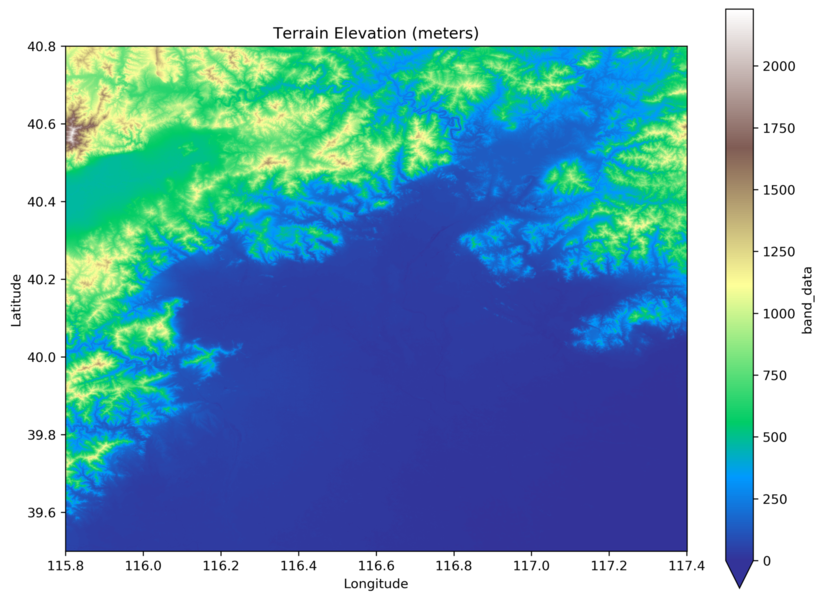

# EVSim: Electric Vehicle Mobility Simulation

This repository is dedicated to simulating the mobility behavior of electric vehicle (EV) users. We provide tools and scripts to facilitate the simulation process using publicly available datasets, with a focus on the Geolife Trajectories GPS dataset. This dataset is used to extract relevant spatio-temporal information to be used in the simulation.

## The tools were implemented as part of the work described in our paper 'From fossil fuel to electricity: studying the impact of EVs on the daily mobility life of users' (see Citation below). An extended version can be downloaded [HERE](https://github.com/alamdari/EVSim/blob/28be0bb996c0d24e5b2cb33027f1c1b8b2ef2ba3/Electrical_Vehicles_2022_EXTENDED_VERSION.pdf).

## Table of Contents

- [Overview](#overview)
- [Citation](#citation)
- [Getting Started](#getting-started)
  - [Prerequisites](#prerequisites)
  - [Downloading Geolife Dataset](#downloading-geolife-dataset)
  - [Using Your Own Trajectory Data](#using-your-own-trajectory-data)
- [Generating Individual Mobility Networks](#generating-individual-mobility-networks)
- [Preparing Road Network](#preparing-road-network)
  - [Downloading Road Network Data](#downloading-road-network-data)
  - [Downloading Charging Station Data](#downloading-charging-station-data)
  - [Getting Elevation Data](#getting-elevation-data)
  - [Preprocessing Road Network Data](#preprocessing-road-network-data)
- [Precomputing Shortest Paths to or from Charging Stations](#precomputing-shortest-paths-to-or-from-charging-stations)
- [Simulation](#simulation)
- [Acknowledgement](#acknowledgement)
- [Contributing](#contributing)
- [License](#license)

## Overview

The main purpose of this repository is to preprocess the Geolife Trajectories GPS dataset for Electric Vehicle (EV) mobility simulation. Our preprocessing pipeline includes downloading the Geolife dataset, filtering the data to extract crucial spatio-temporal information, and preparing it for EV simulation.

## Citation

If you use the code in this repository, please cite our paper:

```
Mirco Nanni, Omid Isfahani Alamdari, Agnese Bonavita, Paolo Cintia. “From fossil fuel to electricity: studying the impact of EVs on the daily mobility life of users.”, submitted to IEEE Transactions on Intelligent Transportation Systems [in review] (2023).
```

## Getting Started

### Prerequisites

Before you begin, make sure you have Python 3.x installed. You can install the required Python libraries with the following command:

```bash
pip install pandas numpy networkx osmnx rasterio zarr xarray rioxarray
```

### Downloading Geolife Dataset

You can use the Geolife Trajectories GPS dataset to build individual mobility networks (IMN) for users. To download and use this dataset, you can visit the Geolife dataset's official source: [Geolife Trajectories GPS dataset](http://research.microsoft.com/en-us/projects/geolife/).

**Note:** When using the Geolife dataset in your research or projects, make sure to provide proper attribution and cite the source according to the dataset's licensing terms.

#### Filtering Geolife Data
We provide a script, `filter_geolife_dataset.py`, that allows you to filter a specific portion of the dataset based on your criteria. This script is particularly useful if you want to narrow down the dataset to a specific geographical area, transportation modes, or date ranges for your analysis.

Please note that you should modify the script to specify your filtering criteria. You can edit the following parameters as needed:
   - `study_modes`: Specify the transportation modes you want to include (e.g., 'car', 'taxi', 'bus', 'train').
   - `study_start_time`, `study_end_time`: Set the start and end dates for your analysis.
   - `study_min_lat`, `study_min_lon`, `study_max_lat`, `study_max_lon`: Define the bounding box for the geographical area you want to study.

If you do not wish to download the Geolife dataset manually, we have included a sample IMN in the `data` folder of this repository for demonstration purposes. You can skip to the section on downloading the road network data if you choose to use the sample IMN. 

We have used the following filters to generate the provided sample IMN:
  - Transportation modes: ['car', 'taxi']
  - Study start date: May 1, 2008
  - Study end date: October 31, 2008
  - Geographic bounding box: Latitude 39.5 to 40.8, Longitude 115.8 to 117.4

### Using Your Own Trajectory Data

If you have your own trajectory data in a format that includes latitude, longitude, timestamp, and user IDs, you can use the `generate_imns.py` script provided in this repository to create IMNs. The details are provided in X.


## Generating Individual Mobility Networks

The `generate_imns.py` script allows you to generate Individual Mobility Networks (IMNs) based on your trajectory data.

To use the script:

- Prepare your trajectory data in a CSV file with headers: `id`, `timestamp`, `latitude`, and `longitude`.

- Run the script with the following command, specifying your input CSV file and desired output file:

```bash
python3 generate_imns.py input.csv output.json.gz --temporal_thr 20 --spatial_thr 50
```

Parameters used for trajectory segmentation temporal_thr (default is 20 minutes) and spatial_thr (default is 50 meters) are optional.

## Preparing Road Network

### Downloading Road Network Data

The `download_road_network.py` script in this repository allows you to download road network data within a specified bounding box based on GPS coordinates from your dataset. Run the script with the following command:

```bash
python3 download_road_network.py data/road_network.graphml --min_lat 39.5 --min_lon 115.8 --max_lat 40.8 --max_lon 117.4
```
The script will save the GraphML file for the subsequent steps.

### Downloading Charging Station Data
The `download_charging_stations.py` script in this repository allows you to download charging station data from the [OpenChargeMap (OCM) API](https://openchargemap.org/) based on geographic coordinates.

**Note:**

- The provided script is a representation and is intended for demonstration purposes. You should customize it according to your specific research requirements. Be mindful of API usage limits and quotas.

- Ensure that you have obtained your own API key from the OpenChargeMap portal and replace `"YOUR OCM API KEY"` with your actual API key in the script.

- We have enclosed the retrieved EV charging station data in the `data` folder of this repository, named `ev_charging_stations.json`. This data includes stations obtained from OpenChargeMap for Beijing area as of October 1, 2023.

### Getting Elevation Data
The `get_elevation_data.py` script in this repository allows you to download elevation data and create a merged GeoTIFF file for a specified geographical region. The script uses the Planetary Computer API 
The script uses the [Planetary Computer API](https://planetarycomputer.microsoft.com/docs/overview/about/) to download [Copernicus DEM - Global and European Digital Elevation Model](https://spacedata.copernicus.eu/collections/copernicus-digital-elevation-model/) data. It downloads elevation data in tiles based on the specified bounding box coordinates and then clips and merges the downloaded elevation data tiles into a single GeoTIFF output file.

Run the `get_elevation_data.py` script with the following command, specifying the output GeoTIFF file path and the bounding box coordinates:

```bash
python3 get_elevation_data.py data/merged_elevation_data.tif --min_lon 115.8 --min_lat 39.5 --max_lon 117.4 --max_lat 40.8
```




### Preprocessing Road Network Data
The `preprocess_road_network.py` script in this repository plays a critical role in preprocessing road network data for the electric vehicle (EV) mobility simulation. It takes road network information, elevation data, and charging station data, and prepares the network for analysis. Run the `preprocess_road_network.py` script with the following command, specifying input and output file paths, bounding box coordinates, and optional parameters:

```bash
python3 preprocess_road_network.py road_network.graphml merged_elevation_data.tif final_road_network.graphml --min_lon 115.8 --min_lat 39.5 --max_lon 117.4 --max_lat 40.8 --default_max_speed 50
```

The script reads the downloaded road network, elevation data, and charging stations data. It then assigns elevations to nodes in the network, correcting edge max speeds as needed, either using existing data from OpenStreetMap or the default maximum speed specified. Based on the elevation of two endpoints, the script assigns a slope to each edge, which is crucial for computing travel times and EV energy consumption (in Joules). The script then assigns charging stations to the closest road network nodes. Finally, the preprocessed road network is saved to the specified output GraphML file path.

## Precomputing Shortest Paths to or from Charging Stations

The `shortest_paths_precomputation.py` script in this repository facilitates the precomputation of shortest paths from all network nodes to charging stations and vice versa.

To precompute shortest paths to and from charging stations run the `shortest_paths_precomputation.py` script with the following command, specifying input GraphML file, and the names of two output files and optional parameter of battery capacity (default is 136800000 Joules ~ 38 KWh)

```bash
python3 shortest_paths_precomputation.py final_road_network.graphml reachable_nodes_from_chargers.csv reachable_chargers_from_nodes.csv --battery_cap 136800000
```

## Simulation

Finally, you can run `main_simulation.py` to perform the EV mobility simulation.
You can customize the simulation parameters and analyze the results.

```bash
python3 main_simulation.py
```

## Acknowledgement
This work is partially supported by the E.C. H2020 programme under the funding scheme Track & Know, G.A. 780754, [Track&Know](https://trackandknowproject.eu) and Horizon Europe research and innovation programme under the funding scheme [Green.Dat.AI](https://greendatai.eu/), G.A. 101070416.

## Contributing

Contributions to this repository are welcome.
If you have improvements or additional features to suggest, please open an issue or submit a pull request.

## License

This project is licensed under the GNU General Public License v3.0 - see the [LICENSE.md](LICENSE.md) file for details.
